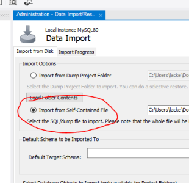
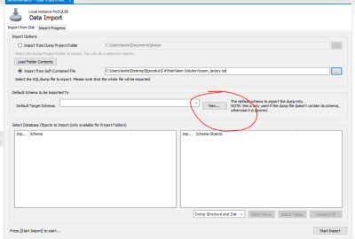
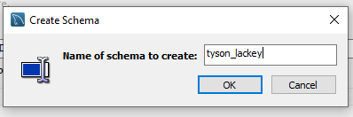

<h1 align="center"><strong>Travel API</strong></h1>

<h4 align="center"><em>API and associated database to track reviews of destinations visited</em></h4>


##### __Created:__ 8/18/2020
##### __Last Updated:__ 8/19/2020 
##### By _**Tyson Lackey & Teresa Rosinski**_  


## Description
This is an API project that offers full CRUD functionality. Users are able to add, remove, view and deleter reviews regarding travel experiences. 

## Setup/Installation Requirements

##### &nbsp;&nbsp;&nbsp;&nbsp;&nbsp;&nbsp;Open via Bash/GitBash:

1. Clone this repository onto your computer:
    "git clone https://github.com/Lackeyt/TravelApi.Solution"
2. Navigate into the "TravelApi.Solution" directory in Visual Studio Code or preferred text editor:
3. Open the project by typing "code ." while in the previous directory in your terminal.
4. Open your computer's terminal and navigate to the directory bearing the name of the program and containing the top level subdirectories and files.
5. Enter the command "dotnet build" in the terminal and press "Enter".
6. Enter the command "dotnet ef migrations add initial"
7. Enter the command "dotnet ef database update"
6. Enter the command "dotnet watch run" in the terminal and press "Enter".


##### &nbsp;&nbsp;&nbsp;&nbsp;&nbsp;&nbsp; Configue MySQL Workbench Database using database import:
1. In the Administration window of SQL Workbench, select 'Data Import/Restore' <br>
<br>
2. Select 'Import from self-contained file" from the data import window.<br>
<br>
3. Navigate to the file path titled tyson_lackey.sql in the Solution file.<br>
<br>
4. Under 'Default Schema to be Imported To', click the "new" button.<br>
<br>
5. Name the schema 'Travel_Api' and click "ok"<br>
<br>
6. Click 'Start Import'<br>
<br>
7. reopen the schemas tab, right click and select "refresh all".<br>

## API Documentation

### &nbsp;&nbsp;&nbsp;&nbsp;&nbsp;&nbsp;Available API Routes:

  * Review List [Type: POST]: http://<span></span>localhost:5000/api/reviews...
      * Returns a list of reviews based on parameters below
      * Parameters:
          - LocationCity (string [max 20 characters])
          - LocationCountry (string [max 20 characters])
          - userName (string [max 20 characters])
          - random (boolean [true/false])

  * Create Review [Type: POST]: http://<span></span>localhost:5000/api/reviews...
      * Creates a new Review records, all fields required for valid entry.
      * Parameters:
          - LocationCity (string [max 20 characters]) *required
          - LocationCountry (string [max 20 characters]) *required
          - userName (string [max 20 characters]) *required
          - ReviewText (string [max 250 characters]) *required

  * Review Info [Type: GET]: http://<span></span>localhost:5000/api/reviews/{id}
      * Returns a single review record based on the id parameter below
      * Parameters:
          - id (integer) *required

  * Review Update [Type: PUT]: http://<span></span>localhost:5000/api/reviews/{id}?userName={user name}
      * Updates a single review record based on the id parameter below, userName parameter must match the userName on the record. 
      * Parameters:
          - id (integer) *required
          - userName (string [max 20 characters], must match userName on record) *required

  * Review Delete [Type: DELETE]: http://<span></span>localhost:5000/api/reviews/{id}?userName={user name}
      * Deletes a single review record based on the id parameter below, userName parameter must match the userName on the record. 
      * Parameters:
          - id (integer) *required
          - userName (string [max 20 characters], must match userName on record) *required

### &nbsp;&nbsp;&nbsp;&nbsp;&nbsp;&nbsp; Using the review list:

  * Using a platform like Postman, specify the type of request (GET/POST/PUT/DELETE)
  * Enter the appropriate URL for your route above.
  * Define any optional parameters if available and click "send"

      ```
      Call:
        Type: GET
        http://localhost:5000/api/reviews?LocationCity=Portland&userName=Steve

      Response (JSON, format: pretty):
        {
          "ReviewId": 5,
          "UserName": "Steve",
          "LocationCity": "Portland",
          "LocationCountry: "USA",
          "ReviewText": "It rains a lot, never coming back >:("
        }
      ```
      
      ```
      Call:
        Type: GET
        http://localhost:5000/api/reviews?random=true
      
      Response (JSON, format: pretty):
        {
          "ReviewId": 3,
          "UserName": "Bob",
          "LocationCity": "Paris",
          "LocationCountry: "France",
          "ReviewText": "Great food!"
        }
      ```

      ```
      Call:
        Type: PUT
        http://localhost:5000/api/reviews/5?userName=Tyson

      Response:
        n/a
        -DB record modified-
      ```

### &nbsp;&nbsp;&nbsp;&nbsp;&nbsp;&nbsp; Swagger UI use:

  * API calls can be used through the swagger UI
    http://<span></span>localhost:5000/

## Known Bugs

* n/a

## Support and contact details

* Discord: TysonL#4409
* Email: lackeyt90@gmail.com


## Technologies Used

* Visual Studio Code
* C#
* Swagger
* MySQL Workbench
* Entity Framework
* .NET Core

### License

Copyright (c) 2020 **_Tyson Lackey and Teresa Rosinski_**

This software is licensed under the MIT license.